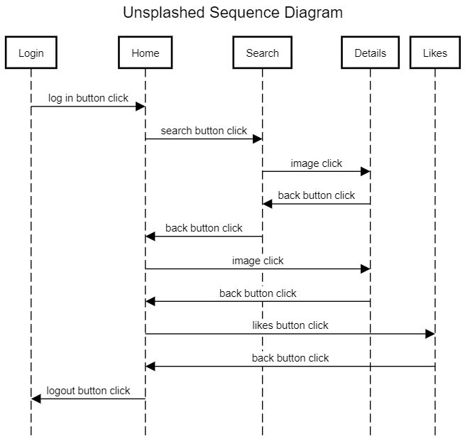
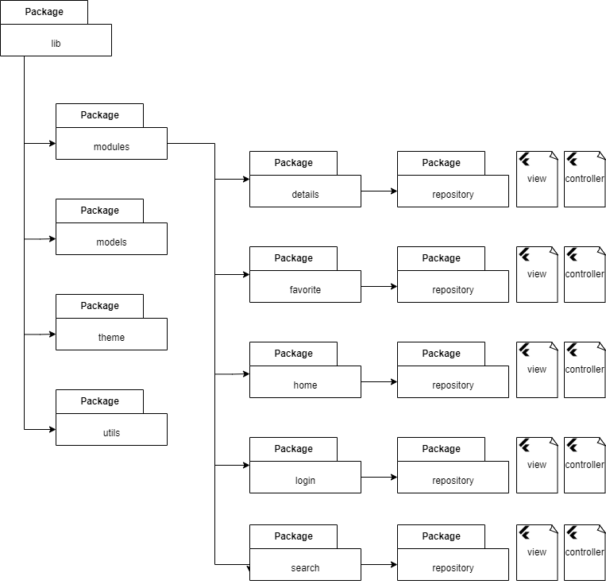

# unsplashed client

## flutter in 10 days
A Flutter project to demonstrate api calls and firebase integration. It uses mobx for state management.
- User can register in the app and browse for wallpapers and stock images hosted on unsplash.
- User can like the image to keep it in their account.
- User can download the image, downloading opens the image in their browser from where they can right click and download.

The app contains five screens.
Login / Registration Screen, Home Screen, Search Screen, Details Screen and Likes Screen

The keys for firebase and unsplash api is not pushed to repository. You can test out the app at https://thatrohit.github.io

This is what the sequence diagram looks like:

This is what the folder structure looks like:

Each module contains a view and a controller. 
The view only contains code related to rendering the UI.
The controller is responsible for the business logic.
The controller uses Store mixin from mobx library for broadcasting changes which the view listens.
****
## features showcased
Login Screen:

- form validation for login and password
- firebase auth for login and registration
- checkbox to use local json instead of unsplash json (this is because unsplash has a rate limit of 50 queries/hour)

Home Screen:

- two horizontal list view in a vertical scroll view
- state listeners for total number of liked image from firebase and images api calls

Like Screen:

- grid view showcasing liked images saved in firebase

Search Screen:

- responsive grid view which increases/decreases in size based on screen size
- fetches response from unsplash api and displays in grid view

****
## Pending list:
1. integrate dependency injection.
2. increase test coverage.
3. handle accessibility in all screens.

